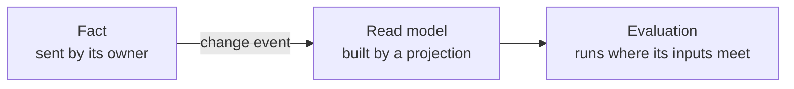
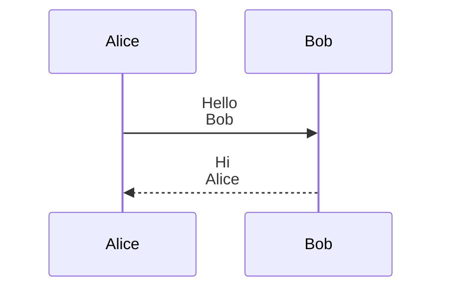

# line breaks in labels

Mermaid writes ` ` in a label as an unclosed ` `. Both diagrams must render, with each label on two lines.

```mermaid
flowchart LR
  F["Fact<br/>sent by its owner"] -- "change event" --> R1["Read model<br/>built by a projection"]
  R1 --> E1["Evaluation<br>runs where its inputs meet"]
```

```mermaid
sequenceDiagram
  Alice->>Bob: Hello<br/>Bob
  Bob-->>Alice: Hi<br/>Alice
```

Text after.
