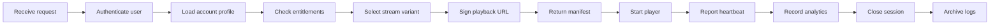

# Wide flowchart

```mermaid
flowchart LR
  A[Receive request] --> B[Authenticate user] --> C[Load account profile] --> D[Check entitlements] --> E[Select stream variant] --> F[Sign playback URL] --> G[Return manifest] --> H[Start player] --> I[Report heartbeat] --> J[Record analytics] --> K[Close session] --> L[Archive logs]
```

Text after the wide diagram.
